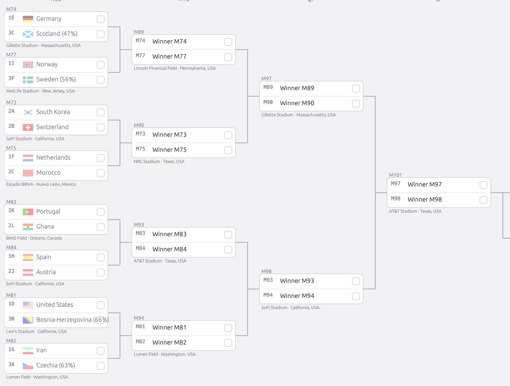
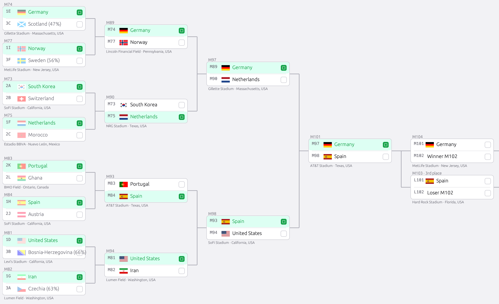
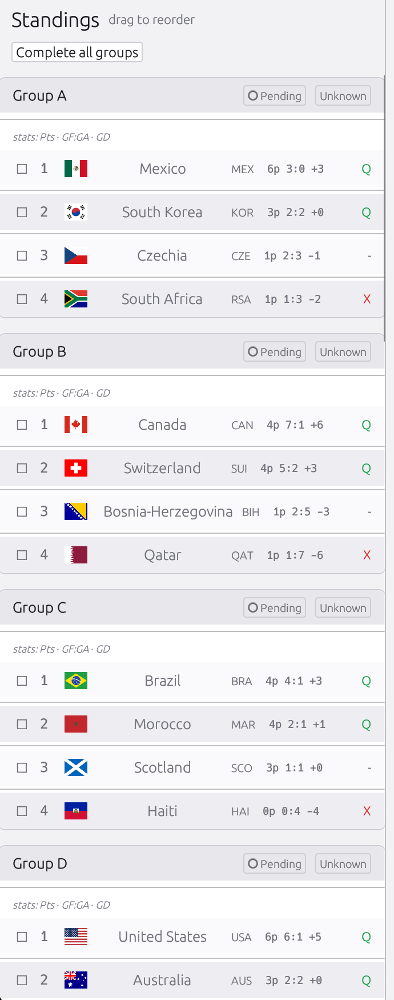
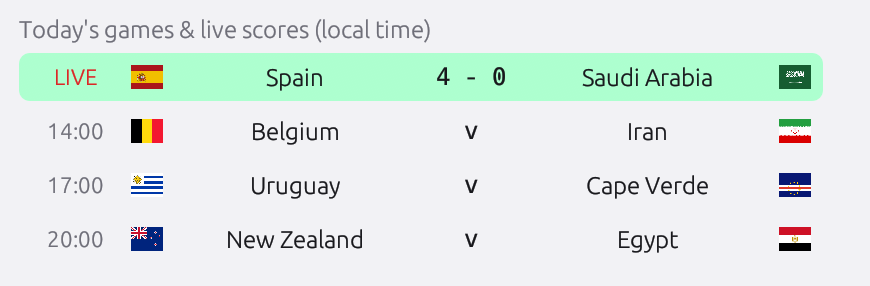
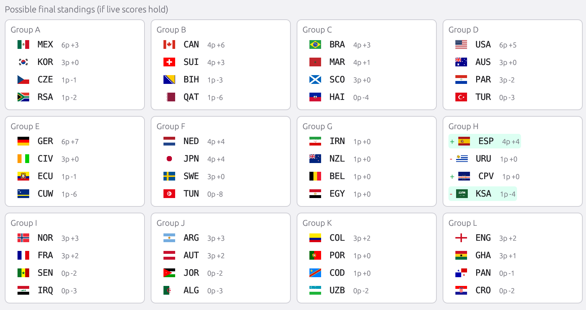
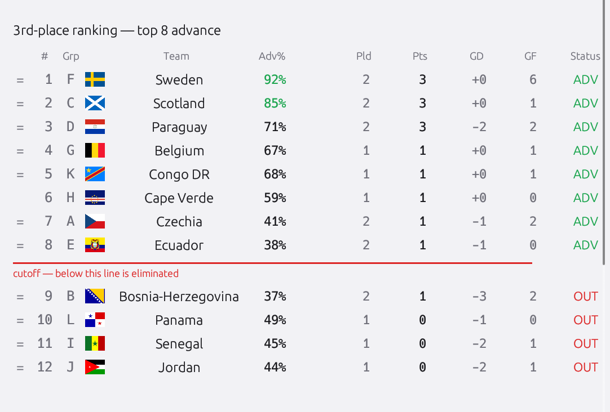
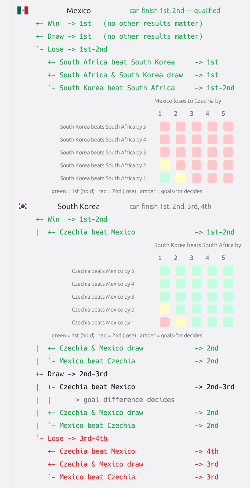

# WC26_Bracket

A desktop app (Rust + [egui]/[eframe]) for building out the FIFA World Cup 2026
knockout bracket. Reorder the group standings, see which third-place teams each
group winner could face in the Round of 32, then click your way from the Round
of 32 all the way to the Final — or flip on **Live mode** to pull real scores,
auto-rank the table, and see exactly what every team needs to qualify.

## Screenshots

| | |
|---|---|
|  **Empty bracket** — the full knockout tree, ready to fill. |  **Pick your bracket** — click teams through R32 → Final. |
|  **Standings editor** — drag to reorder each group's four teams. |  **Today's games** — live scores in local time, in-play match glowing. |
|  **Possible final standings** — live projection if current scores hold. |  **3rd-place race** — advance odds + exact IN/OUT verdicts. |
|  **What needs to happen** — per-team qualification decision tree with a goal-difference grid. | |

## Features

- **Standings editor** — drag to reorder each group's four teams; mark each
  group's third-place team as Advanced / Eliminated / Unknown.
- **Annex C predictions** — from the official third-place allocation table, the
  app shows each first-place team's possible third-place opponents (with
  percentages) and narrows the field as you lock in results.
- **Full clickable bracket** — Round of 32 → Round of 16 → Quarter-finals →
  Semi-finals → Final, plus the third-place playoff. Click a team (or its
  checkbox) to advance it; the winner flows into the next round automatically.
  Click the winning side again to clear the result.
- **Certain opponents resolve** — once only one third-place opponent remains
  possible for a slot, later rounds show the real team name instead of
  "3rd place".
- **Hide standings** — collapse the left panel for a full-width bracket view.
- **Save / Reload** — one **Save** snapshots everything (standings order +
  third-place status, theme, panel visibility, and bracket picks); **Reload**
  restores that snapshot, discarding unsaved changes. Nothing is written until
  you press Save, so a cleared bracket can always be reloaded back.
- **Dark / light theme** — toggle from the top bar; saved with everything else.
- **Champion banner** — once the Final is decided, the winner is shown up top.
- **Guided tutorial** — a 3-step onboarding (arrange groups → pick the 4 worst
  3rd-place teams → make your first bracket pick); replayable from `? Tutorial`.
- **Named saves + import/export** — save brackets under a name, load/delete them,
  or import/export `.json` files anywhere to share with others (`📁 Saves`).
- **Print** — `🖨 Print` opens a landscape bracket + group-standings report in
  your browser (Cmd/Ctrl+P to print), with flags.
- **Live mode** — pull real scores and standings, auto-rank the table, and see
  exactly what each team needs to qualify; see below.

## Live Mode

Open `🛰 Live`, optionally paste a [football-data.org] token, and turn on **Live
mode** (auto-polls every 20s). It opens a movable **Live Center** with:

- **Today's games & live scores** (local time) — the in-play match breathes green.
- **Possible final standings** — a what-if projection if current scores hold,
  with ▲/▼ movement arrows and the live game highlighted.
- **3rd-place ranking** — the 12 third-place teams ranked (top 8 advance), a
  full header row, and per team: a **Monte-Carlo chance** (Adv%) of reaching the
  R32, an exact **IN** (guaranteed top-8) / **OUT** (mathematically eliminated)
  verdict, and the live Pld / Pts / GD / GF. Ranked off the *projection* so it
  tracks in-play scores.
- **What needs to happen** — once a group is down to its final round (≤2 games
  left), a per-team qualification **decision tree**. Groups start collapsed;
  expand one to compute it. For each of Win / Draw / Lose it names every
  other-match outcome and the resulting finish, with exact margin rules
  ("lose to Czechia by 1 → 1st unless South Korea win by ≥2"). When a result
  locks the finish regardless of the other game, it says so.
- **Goal-difference grid** — when goals in *two* matches decide a place, a
  2-D grid plots your own margin against the rival's, green where you hold, red
  where you lose, amber on the goal-difference tie line (goals-for decides). The
  hold↔lose boundary is the "goal-difference of goal-differences" diagonal.
- **Goal alerts** — bottom-right toasts when a team scores or crosses a cutoff.

**Clinched positions** go solid in the standings table (with a 🔒) and the
bracket once a team's final group position is mathematically certain. In live
mode the standings table also **re-sorts started groups to the possible final
standings** (finished results + in-play scores) by the full FIFA tiebreak chain
(points → GD → GF → fair-play cards → FIFA rank), and that order — including each
group's 3rd-place team — flows straight into the bracket; un-started groups keep
your predicted order, and turning live off leaves your groups untouched.

**Data sources.** Live scores and just-finished results come from **ESPN's
public scoreboard** (no key needed). Group **standings, remaining fixtures, and
cards** come from **football-data.org** if you provide a token (env
`FOOTBALL_DATA_TOKEN` or the in-app field; one request per sync, well under the
free tier's 10/min). Finished matches from both sources are **unioned and deduped
by matchup**, so the moment ESPN flips a game to FT it lands in the table —
football-data just confirms it later (and supplies the fair-play card data). The
`🛰 Live` window also shows an **API log** of every request for debugging.

## Where State Lives

- **Live save** — written to your OS config directory on first Save:
  - macOS: `~/Library/Application Support/WC26_Bracket/save.json`
  - Windows: `%APPDATA%\WC26_Bracket\save.json`
  - Linux: `~/.config/WC26_Bracket/save.json`
- **Team seed** — the official group draw (names, 3-letter codes, flag emoji)
  is baked into the binary as `SEED_TEAMS` in `src/lib.rs`. Flags are embedded
  from `assets/flags/` via `include_bytes!` — PNGs for in-app rendering, SVGs for
  the browser print report.
- **Load order** — `save.json` if present, otherwise the built-in seed teams.

## Run The Desktop App

```bash
cargo run --bin wc26_bracket
```

Opens a window titled **WC26_Bracket**.

### Using it

- Drag the `⠿` handles in the left panel to reorder teams.
- Toggle each group's third-place status with the per-group button or the
  `3rd place:` chips above the bracket.
- Click a team in any match to advance it; click it again to undo.
- **Save** snapshots standings, theme, panel, and bracket picks to your OS
  config dir; **Reload** restores the last saved snapshot.

## Data Flow

```text
data/FWC26_regulations_AnnexC.pdf
  -> data/annex_c_extracted.txt
  -> cargo run --bin generate_annex_json
  -> data/annex_c.json
  -> cargo run
```

## Generate Annex JSON

The generator reads the extracted Annex C table top-down. A line counts as a
table row only when it has an option number followed by eight third-place
entries such as `3E`.

```bash
cargo run --bin generate_annex_json
```

- Default input: `data/annex_c_extracted.txt`
- Default output: `data/annex_c.json`

## Optional Occurrence Report

```bash
cargo run --bin analyze_matches
```

Writes `data/match_occurrences.txt`.

## Build An Executable

```bash
cargo build --release
```

- macOS/Linux: `target/release/wc26_bracket`
- Windows: `target/release/wc26_bracket.exe`

The binary is self-contained — teams, flags, and the Annex C table are embedded,
so nothing in `data/` is needed at runtime.

### Cross-platform builds

**macOS universal** (Intel + Apple Silicon):

```bash
cargo build --release --target x86_64-apple-darwin
cargo build --release --target aarch64-apple-darwin
lipo -create -output dist/wc26_bracket \
  target/x86_64-apple-darwin/release/wc26_bracket \
  target/aarch64-apple-darwin/release/wc26_bracket
```

**Windows** (from macOS; needs `brew install mingw-w64`):

```bash
rustup target add x86_64-pc-windows-gnu
CARGO_TARGET_DIR=/tmp/wc26_win cargo build --release --target x86_64-pc-windows-gnu
# → /tmp/wc26_win/x86_64-pc-windows-gnu/release/wc26_bracket.exe
```

Built binaries are written to `dist/` (git-ignored); attach them to a GitHub
Release. The app has no audio/system dependencies, so the Linux build is fully
self-contained.

## Tests

```bash
cargo test
```

## License

[MIT](LICENSE).

[egui]: https://github.com/emilk/egui
[eframe]: https://crates.io/crates/eframe
[football-data.org]: https://www.football-data.org/
